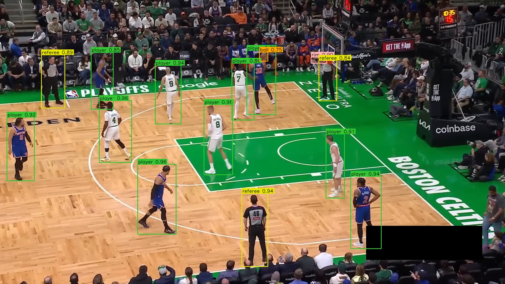
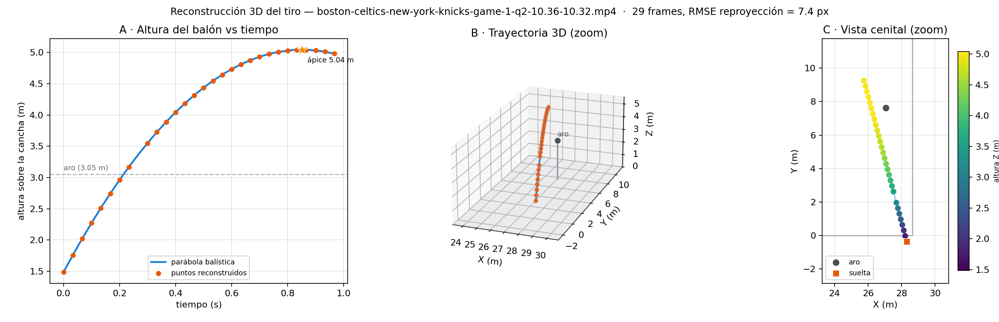
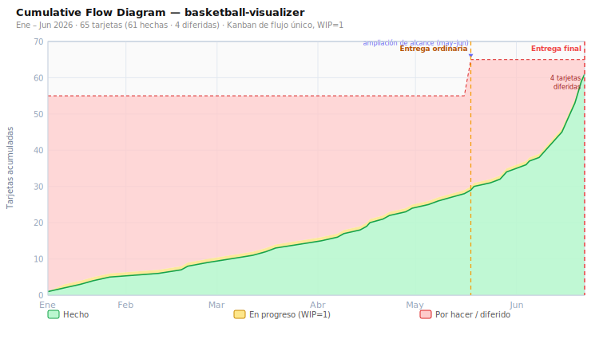

<div align="center">

# 🏀 basketball-visualizer — Análisis táctico de baloncesto

**Pipeline de visión por computador que detecta, sigue e identifica a los jugadores en vídeo de baloncesto, proyecta la jugada a una vista cenital 2D y la enriquece con reconstrucción 3D del tiro y reconocimiento de pantallas — con modelos entrenados/enlazados localmente.**

[](https://www.python.org/)
[](https://pytorch.org/)
[](https://vuejs.org/)
[](https://fastapi.tiangolo.com/)
[](#licencia)

</div>

---

## 📖 Tabla de contenidos

- [Descripción](#descripción)
- [Características](#características)
- [Arquitectura](#arquitectura)
- [Stack tecnológico](#stack-tecnológico)
- [Instalación](#instalación)
- [Uso rápido (CLI)](#uso-rápido-cli)
- [Análisis avanzado (3D y tácticas)](#análisis-avanzado-3d-y-tácticas)
- [Aplicación web](#aplicación-web)
- [Roster (nombres y colores de equipo)](#roster-nombres-y-colores-de-equipo)
- [Rendimiento y resultados](#rendimiento-y-resultados)
- [Entrenamiento de modelos](#entrenamiento-de-modelos)
- [Estructura del proyecto](#estructura-del-proyecto)
- [Metodología](#metodología)
- [Documentación](#documentación)
- [Licencia](#licencia)

---

## Descripción

`basketball-visualizer` toma un clip de baloncesto y produce **dos vídeos**: el original anotado (cajas, equipos, dorsales y nombres) y un **mapa cenital 2D** con las posiciones de los jugadores y el balón proyectadas sobre el plano de la cancha. Opcionalmente añade **reconstrucción 3D de la trayectoria del tiro** y **reconocimiento de pantallas** (*screens*) en post-proceso.

<div align="center">
  
  <br><sub>Detección e identidad: jugadores por equipo, árbitro, balón y poseedor.</sub>
</div>

Combina el flujo de detección/identidad con la proyección 2D y el tracking de balón, **usando modelos propios entrenados o enlazados en local** (sin inferencia alojada). El bloque analítico se apoya en literatura del dominio: el tracking y la 3D del balón siguen el método de **Pirotta**, el reconocimiento de pantallas el de **Chen et al. (2012)**, y la calibración robusta de cancha integra **KaliCalib**.

El proyecto se distribuye de dos formas:

- 🖥️ **CLI** (`run.py`) — para procesar clips directamente desde la terminal.
- 🌐 **Aplicación web** — SPA en Vue 3 + API FastAPI para subir vídeos, seguir el progreso y visualizar resultados (vídeo + minimapa + tiro 3D + pantallas) en el navegador.

## Características

- 🎯 **Detección local** con RF-DETR (11 clases, incluyendo `player-in-possession`).
- 🧩 **Tracking de jugadores** con SAM 3 (prompt-once inicializado por RF-DETR) o BoT-SORT.
- 👕 **Clasificación de equipos sin etiquetas** vía embeddings SigLIP + UMAP + K-means.
- 🔢 **OCR de dorsal** con un SmolVLM2 fine-tuneado localmente.
- 🏷️ **Resolución de nombre** cruzando equipo + dorsal contra un roster JSON opcional.
- 📐 **Homografía de cancha** por keypoints, con opción de **KaliCalib** para planos abiertos de retransmisión.
- 🏀 **Tracking de balón** seleccionable: suavizado EMA o **filtro de Kalman + validación de trayectoria** (método Pirotta).
- 🤝 **Resolución de posesión** robusta con histéresis temporal y salvaguardas ante oclusión, balón en vuelo y forcejeos.
- 📈 **Reconstrucción 3D del tiro** (DLT balístico) con **suelta por pose** opcional (YOLOv8-pose).
- 🧠 **Reconocimiento de pantallas** front / back / down a partir de las trayectorias (Chen et al. 2012).
- 🖥️ **Escalado multi-GPU** por *chunking* del vídeo.
- 🗺️ Salida: **vídeo anotado** + **minimapa cenital** + JSON de metadatos, tiro 3D y tácticas.

## Arquitectura

```
RF-DETR (11 clases, local)
   ├─► SAM 3 / BoT-SORT ...... tracking de jugadores (prompt-once con RF-DETR)
   ├─► TeamClassifier ........ equipos sin etiquetas (SigLIP + UMAP + K-means)
   ├─► SmolVLM2 (local) ...... OCR de dorsal  ──┐
   │                                            ├─► roster → nombre del jugador
   ├─► Keypoints / KaliCalib . homografía ──────┘
   └─► BallTracker (EMA/Kalman) ── posesión
        │
        ├─► mapa cenital 2D  +  vídeo anotado
        │
        └─ post-proceso (sobre metadata por frame) ─►  reconstrucción 3D del tiro
                                                        reconocimiento de pantallas
```

La aplicación web tiene tres piezas independientes:

```
┌───────────────┐   HTTP /api/*   ┌────────────────────┐   subprocess    ┌──────────────┐
│   Frontend    │ ──────────────► │  Backend (FastAPI) │ ──────────────► │  Pipeline ML │
│  Vue 3 + Vite │ ◄────────────── │  backend/app/      │  python -m      │  pipeline/   │
│  (SPA)        │   JSON / vídeo  │  main.py           │  pipeline.run   │              │
└───────────────┘                 └────────────────────┘                 └──────────────┘
```

> Detalle completo en [`docs/arquitectura.md`](docs/arquitectura.md).

## Stack tecnológico

| Capa        | Tecnologías                                                                 |
|-------------|------------------------------------------------------------------------------|
| Visión / ML | PyTorch · RF-DETR · SAM 3 · BoT-SORT · SigLIP · SmolVLM2 · YOLOv8-pose · KaliCalib · `supervision` |
| Geometría   | Homografía / PnP · DLT (trayectoria 3D) · filtro de Kalman                    |
| Backend     | FastAPI · Uvicorn                                                            |
| Frontend    | Vue 3 (`<script setup>`) · Vite 5 (Node 20)                                  |
| Datos       | Roboflow (descarga de datasets) · UMAP · scikit-learn                        |

## Instalación

El proyecto reutiliza el entorno conda del proyecto original, que ya tiene todas las dependencias instaladas:

```bash
conda activate tfg-baloncesto
```

Las dependencias están documentadas en [`requirements.txt`](requirements.txt). Después, enlaza los modelos ya entrenados (RF-DETR, SAM 3, keypoints de cancha):

```bash
python scripts/fetch_models.py
```

> - El frontend usa un **Node 20 local** (`frontend/.node/`); el Node del sistema es demasiado antiguo para Vite 5.
> - La calibración **KaliCalib** es opcional y se enlaza por ruta como código externo en `third_party/KaliCalib/` (no versionado), con su checkpoint en `third_party/KaliCalib/models/`.

## Uso rápido (CLI)

```bash
# Procesar un clip (sin dorsales hasta entrenar el OCR)
python run.py data/clip.mp4 -o data/out.mp4 --no-numbers
#   → data/out.mp4       (vídeo anotado)
#   → data/out_map.mp4   (mapa cenital 2D)

# Con el OCR de dorsal entrenado, los números salen automáticamente
python run.py data/clip.mp4 -o data/out.mp4

# Con roster (nombres de jugador + colores de equipo)
python run.py data/clip.mp4 -o data/out.mp4 \
    --roster data/roster.json --team-names "Lakers,Warriors"
```

<details>
<summary>Opciones disponibles</summary>

| Flag                  | Descripción                                                          |
|-----------------------|----------------------------------------------------------------------|
| `-o, --output`        | Vídeo anotado de salida (por defecto `data/out.mp4`)                 |
| `--no-overlay`        | No escribir el vídeo anotado                                         |
| `--no-map`            | No escribir el mapa 2D                                               |
| `--no-numbers`        | Desactivar el OCR de dorsal                                          |
| `--metadata`          | Escribir metadatos JSON por frame (necesario para 3D y tácticas)     |
| `--clean-paths`       | Suavizar trayectorias (`sports.clean_paths`)                         |
| `--progress-every N`  | Avisar cada N frames                                                 |
| `--roster`            | JSON con rosters (dorsal → nombre)                                   |
| `--team-names`        | Nombres de los dos equipos, p.ej. `'Lakers,Warriors'`               |
| `--tracker`           | Tracking de jugadores: `sam` (máscaras) o `botsort` (más rápido)     |
| `--ball-tracker`      | Tracking de balón: `ema` (suavizado) o `kalman` (Pirotta)           |
| `--shot3d`            | Reconstrucción 3D del tiro (requiere `--metadata`)                   |
| `--no-shot3d-pose`    | 3D sin detección de suelta por pose (YOLOv8-pose)                   |
| `--tactics`           | Reconocer pantallas (*screens*) tras el análisis (requiere `--metadata`) |

</details>

## Análisis avanzado (3D y tácticas)

Ambos bloques son **post-proceso opcional** sobre los metadatos por frame, así que requieren `--metadata`:

```bash
# Reconstrucción 3D de la trayectoria del tiro (DLT balístico + suelta por pose)
python run.py data/clip.mp4 -o data/out.mp4 --metadata --shot3d
#   → data/out_shot3d.{json,mp4}   (suelta, ángulo de salida, ápice)

# Reconocimiento de pantallas (front / back / down) sobre las trayectorias
python run.py data/clip.mp4 -o data/out.mp4 --metadata --tactics
#   → data/out_tactics.json        (recuento y eventos de screen)
```

- **3D del tiro** (`pipeline/shot3d/`, `pipeline/court/ball_3d.py`): resuelve la parábola balística 3D a partir de las detecciones 2D del balón y la matriz de proyección de cámara por frame (DLT 2N×6, método de **Pirotta** cap. 5.2). La **suelta por pose** siembra la 3D con el frame real de release usando YOLOv8-pose sobre el recorte del poseedor.
- **Pantallas** (`pipeline/tactics/`): detecta el bloqueo (contacto *screener* ↔ defensor con el defensor "entre" los dos atacantes) y lo clasifica en front / back / down por ángulos y aproximación al aro, siguiendo a **Chen et al. (2012)**.

<div align="center">
  
  <br><sub>Reconstrucción 3D del tiro: trayectoria balística, suelta, ángulo de salida y ápice.</sub>
</div>

## Aplicación web

Compila el frontend y arranca el backend FastAPI (que sirve los estáticos compilados):

```bash
bash serve.sh                  # http://0.0.0.0:8000
bash serve.sh --port 8080      # puerto personalizado
```

Sube un vídeo desde el panel lateral, elige el modo de tracker, sigue el progreso del trabajo y visualiza el vídeo anotado junto al minimapa 2D, la **trayectoria del tiro** (3D o fallback 2D) y el **panel de pantallas** reconocidas. El roster se sube opcionalmente: nombres de jugador, de equipo y colores se aplican automáticamente al resultado.

## Roster (nombres y colores de equipo)

Opcional. Un JSON indexado por **nombre de equipo**, con el color de la camiseta y el mapeo `dorsal → nombre`:

```json
{
  "Boston Celtics":  { "colors": "#FFFFFF", "players": { "0": "Tatum",   "7": "Brown"    } },
  "New York Knicks": { "colors": "#1D428A", "players": { "11": "Brunson", "23": "Robinson" } }
}
```

- `colors` — color de la **camiseta que se juega ese partido** (no el de marca). Se usa para emparejar cada equipo con el cluster detectado y asignar nombres al equipo claro/oscuro de forma automática (no posicional).
- `players` — resuelve el nombre cruzando equipo + dorsal (del OCR).

En la app web, la capa interactiva del frontend reorienta además por coincidencia de dorsales, de modo que el equipo claro/oscuro queda correcto aunque el color del roster no encaje.

## Rendimiento y resultados

Medido sobre clip NBA (180 frames, 720p, 30 fps) en **NVIDIA A100-40GB** (ver [`docs/datos-reales-tfg.md`](docs/datos-reales-tfg.md) y [`docs/perf-results.json`](docs/perf-results.json)):

| Configuración            | Tiempo de pared | VRAM pico                | Speedup       |
|--------------------------|-----------------|--------------------------|---------------|
| 1× A100                  | 187,0 s         | ≈ 7,8 GB                 | 1,0× (base)   |
| 2× A100 (*chunking*)     | 126,7 s         | ≈ 5,9 GB / GPU           | **1,48×**     |

- Cuello de botella en la cadena de identidad/segmentación, no en la detección (RF-DETR ≈ 91 ms/frame). El speedup multi-GPU es sublineal y tiende a 2× con clips más largos.
- **3D del tiro** (ver [`docs/resultados-trayectoria-3d.md`](docs/resultados-trayectoria-3d.md)): ápice y ángulo de salida en rango realista (p.ej. 39–50°, aro NBA 3,05 m), con RMSE de reproyección de hasta ≈ 7 px en el mejor clip.

> Las cifras provienen de mediciones del repositorio; no se reportan métricas no medidas.

## Entrenamiento de modelos

Solo el **OCR de dorsal** se entrena en este proyecto; el resto de modelos se enlazan con `scripts/fetch_models.py`.

```bash
# 1. Descargar el dataset de Roboflow (la API key solo se usa para descargar)
python scripts/download_jersey_dataset.py --workspace <tu_workspace>

# 2. Fine-tune del VLM → models/jersey-ocr/
python scripts/train_jersey_ocr.py --data data/jersey-numbers --epochs 5
```

Otros scripts disponibles: `train_rfdetr.py`, `train_court_keypoints.py`, evaluación (`eval_*.py`), benchmarks de tracking/cancha (`compare_ball_tracker.py`, `benchmark_kali.py`) y medición de rendimiento (`measure_performance.py`).

## Estructura del proyecto

```
basketball-visualizer/
├── pipeline/                 Pipeline ML (CLI: python -m pipeline.run)
│   ├── detection/            RF-DETR local (11 clases)
│   ├── tracking/             SAM 3 / BoT-SORT, balón (EMA y Kalman), punto de apoyo
│   ├── teams/                Clasificador de equipos SigLIP (sin etiquetas)
│   ├── identity/             OCR de dorsal (SmolVLM2 local) + roster
│   ├── court/                Keypoints, KaliCalib, homografía, cámara, render 2D, 3D del balón
│   ├── pose/                 Estimación de pose (YOLOv8-pose) y suelta del tiro
│   ├── possession/           Resolución de posesión (histéresis + salvaguardas)
│   ├── scoring/              Tracking de tiros (eventos de canasta)
│   ├── shot3d/               Reconstrucción 3D de la trayectoria (DLT balístico)
│   ├── tactics/              Reconocimiento de pantallas (Chen et al. 2012)
│   ├── strategy/             Estrategias de resolución de posesión
│   ├── io/                   E/S de vídeo y metadatos por frame
│   └── orchestrator.py       Bucle por frame que une todas las etapas
├── backend/app/              API FastAPI (auth, jobs, GPU, tácticas, sirve el frontend)
├── frontend/                 SPA Vue 3 + Vite (dist/ versionado)
├── scripts/                  Fetch de modelos, datasets, entrenamientos, benchmarks, figuras
├── tests/                    Suite pytest (posesión, tácticas, homografía, roster, chunking)
├── docs/                     Arquitectura, metodología, estado del arte, resultados y figuras
├── run.py                    CLI del pipeline
├── serve.sh                  Compila el frontend y arranca el backend
└── requirements.txt          Dependencias Python (entorno conda tfg-baloncesto)
```

> `data/`, `models/`, `third_party/`, `*.mp4`, `*.pdf`, `*.log` y `frontend/.node|node_modules` están en `.gitignore`. `frontend/dist/` **sí** se versiona (lo sirve el backend).

## Metodología

Desarrollado con **Kanban** (WIP = 1, una tarjeta por commit) sobre las fases de **CRISP-DM**, con trazabilidad tarjeta ↔ commit. El avance se documenta con un *Cumulative Flow Diagram* y un diagrama de progreso por áreas (`docs/cfd*.svg`, `docs/progreso.svg`). Detalle en [`docs/metodologia.md`](docs/metodologia.md).

<div align="center">
  
  <br><sub>Cumulative Flow Diagram: 51/55 tareas completadas (Ene–Jun 2026), WIP = 1.</sub>
</div>

## Documentación

- 📐 [`docs/arquitectura.md`](docs/arquitectura.md) — estructura completa de frontend, backend y pipeline, convenciones y la tabla *"quiero cambiar X, ¿dónde toco?"*.
- 📋 [`docs/metodologia.md`](docs/metodologia.md) — metodología del TFG (Kanban + CRISP-DM) y CFD.
- 📚 [`docs/estado-del-arte.md`](docs/estado-del-arte.md) — conceptos del dominio, trabajos afines y selección de alternativas.
- 📊 [`docs/datos-reales-tfg.md`](docs/datos-reales-tfg.md) — cronología, métricas medidas y rendimiento multi-GPU.
- 🏀 [`docs/resultados-trayectoria-3d.md`](docs/resultados-trayectoria-3d.md) — tracking de balón (Kalman) y 3D del tiro (Pirotta).
- 🧠 [`docs/tacticas-screen-recognition.md`](docs/tacticas-screen-recognition.md) — reconocimiento de pantallas (Chen et al. 2012).
- 🤸 [`docs/progreso-pose-release.md`](docs/progreso-pose-release.md) — detección de suelta por pose.

## Licencia

Proyecto académico (Trabajo de Fin de Grado). Uso educativo.
