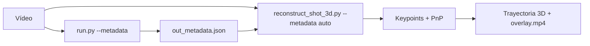

# Resultados — Tracking del balón y reconstrucción 3D del tiro

Resumen del trabajo realizado sobre la trayectoria del balón (método de Luca
Pirotta, *"Ball Detection and Tracking in a Basketball Scene"*). Material de
apoyo para la memoria del TFG.

## 1. Tracking 2D del balón (cap. 4 de Pirotta)

Se añadió un seguidor por **filtro de Kalman** (`pipeline/tracking/ball_tracker_kalman.py`)
con modelo de velocidad constante (ec. 4.13: matrices A 4×4 y H 2×4) y validación
geométrica de la trayectoria (recta en X, parábola en Y; descarte de tracklets
< 10 frames, sección 4.2.1). Convive con el seguidor EMA original
(`pipeline/tracking/ball_tracker.py`); se elige con `--ball-tracker {ema,kalman}`.

- El detector profundo RF-DETR sustituye la etapa GMM + filtros de forma de
  Pirotta; se adopta solo la parte de **tracking** (Kalman + validación).
- Comparación EMA vs Kalman: `scripts/compare_ball_tracker.py`.

## 2. Reconstrucción 3D del tiro (cap. 5.2 de Pirotta)

`pipeline/court/ball_3d.py` resuelve la trayectoria balística 3D a partir de:
detecciones 2D del balón + matriz de proyección de cámara **P = K·[R|t]** por
frame (de la calibración PnP existente) + tiempo. Sistema DLT sobredeterminado
2N×6 → `[X0, Vx, Y0, Vy, Z0, Vz]` (ec. 5.6).

- **Mundo en pies** (cancha en Z=0), g = 32.174 ft/s²; **salidas en metros**.
- `scripts/reconstruct_shot_3d.py`: pipeline completo + autoselección del arco
  balístico + **extensión hacia atrás hasta la suelta** + veredicto físico.
- `scripts/plot_shot_3d.py`: figura de 3 paneles (altura vs tiempo, 3D, cenital).
- Vídeo con la parábola 3D reproyectada (`--save-video`).

### Resultados (2 clips, ambos PLAUSIBLE)

| Clip | Ventana | Suelta Z | Ángulo salida | Ápice | RMSE reproy. |
|------|---------|----------|---------------|-------|--------------|
| q2-08.43-08.38 | 147–179 | 3.1 m | **49.7°** | 5.81 m | 19.3 px |
| q2-10.36-10.32 | 46–75   | 1.5 m | 39.0° | 5.04 m | 7.4 px |

Aro NBA = 3.05 m. El ángulo de 49.7° está en el rango de un tiro real (45–52°).
Artefactos en `docs/results/shot3d*.{json,png,pdf,mp4}`.

## 3. Hallazgos clave (relevantes para la defensa)

1. **La ruta PnP nunca se activa en clips de retransmisión.** La focal se
   autocalibra (~3668 px), pero `solvePnP` da ~9–18 px de error de reproyección
   y el gate RANSAC es de 5 px → el pipeline en vivo usa siempre la homografía de
   suelo de respaldo, no la pose PnP. Para la 3D se añadió
   `PnPCameraEstimator.solve_projection()` (PnP tolerante) sin tocar la ruta viva.
2. **Ambigüedad de signo de la normal en PnP planar.** A menudo recupera +Z hacia
   el suelo → daban alturas negativas. Se corrige autodetectando "arriba" desde el
   centro de cámara (`auto_orient`).
3. **El eje vertical (altura) se reconstruye bien; el horizontal (X,Y en pista) es
   ruidoso** por poca paralaje — coincide con el aviso de mal condicionamiento de
   la tesis (pág. 56).
4. **Detección del tiro automática pero geométrica**, no semántica: localiza el
   arco balístico dominante (balón que sube y baja), no clasifica "tiro" vs pase.
   La suelta se localiza extendiendo la ventana hacia atrás mientras el modelo
   balístico siga ajustando, con guardarraíl físico (altura de suelta ≥ 1.2 m).

## 4. Tests

`tests/test_ball_tracker_kalman.py` (9) y `tests/test_ball_3d.py` (6): recuperación
exacta de trayectoria sintética, robustez a ruido, auto-orientación, holdover.

## 5. Línea de trabajo siguiente

Detector de **suelta por pose** (YOLOv8-pose sobre el recorte del poseedor) para
sembrar la reconstrucción 3D con el frame de release real y reforzar el trigger
del `ShotTracker`. Progreso en `docs/progreso-pose-release.md`.

---

## 6. Mejoras recientes (jun 2026)

### 6.1 Extrapolación de la parábola en el overlay

Antes el vídeo `--save-video` solo dibujaba el tramo con detecciones (p. ej.
frames 46–75). Ahora:

- **`Trajectory3D.extrapolation_end()`** (`pipeline/court/ball_3d.py`): calcula
  analíticamente hasta cuándo continúa el arco (cruce de **Z = altura del aro**
  en bajada, o **Z = 0** / suelo).
- **Anclaje al aro detectado**: la reproyección 3D se extiende hasta entrar en
  el bbox del aro (clase `rim` del RF-DETR, la misma señal que usa
  `ShotTracker`). Si la calibración horizontal es imprecisa, se usa el punto de
  máxima aproximación (≤ 3× radio del bbox) y el trazo se une visualmente al
  círculo dorado del aro en imagen.
- **Marcador de fin**: naranja = aro, gris = suelo.

> **Nota:** SAM 3 solo trackea **jugadores**. El aro no va en el memory bank de
> SAM; se obtiene por detección `rim` (clase 10) cada frame, igual que en el
> pipeline en vivo (`ctx.hoop_detections`).

### 6.2 Flags CLI nuevos (`scripts/reconstruct_shot_3d.py`)

| Flag | Efecto |
|------|--------|
| `--pose-release` | Suelta por YOLOv8-pose; puede acortar el inicio de la ventana 3D |
| `--require-parabola` | Kalman exige parábola cóncava en Y (solo modo detector) |
| `--metadata [PATH]` | Reutiliza JSON del pipeline; sin valor → `{input_stem}_metadata.json` |
| `--save-video` | Vídeo con parábola extrapolada + aro dorado |

### 6.3 Reutilización de metadata del pipeline

El script ya **no duplica RF-DETR** si existe metadata previa:

```bash
# 1) Análisis estándar (genera {out_stem}_metadata.json)
python run.py data/test_videos/clip.mp4 \
    -o data/test_videos/clip_pipeline.mp4 --metadata --no-map

# 2) Reconstrucción 3D leyendo balón/aro/jugadores del JSON
python scripts/reconstruct_shot_3d.py \
    --input data/test_videos/clip.mp4 \
    --metadata auto \
    --pose-release \
    --save-video docs/results/shot3d_overlay.mp4 \
    --json-out docs/results/shot3d.json
```

Con `-o data/test_videos/clip_pipeline.mp4`, ``--metadata auto`` encuentra
``clip_pipeline_metadata.json`` en la misma carpeta. También se puede pasar la
ruta explícita (p. ej. metadata de un job web:
``data/outputs/{job_id}/overlay_metadata.json``).

**Qué se reutiliza del JSON** (`MetadataWriter` → `{out}_metadata.json`):

| Campo | Uso en 3D |
|-------|-----------|
| `ball.bbox` | Centro 2D del balón (salida del `BallTracker` del pipeline) |
| `rims[].bbox` | Centro y radio del aro (misma señal que `ShotTracker`) |
| `players[].bbox` | Poseedor aproximado para `--pose-release` |

**Qué sigue calculándose en el script 3D** (no está en la metadata):

- Keypoints de cancha (YOLO-pose 33 kpts) + estabilización
- Matriz de proyección **P = K·[R|t]** por frame (`PnPCameraEstimator.solve_projection`)
- Ajuste balístico 3D y overlay

Módulo: `pipeline/io/pipeline_metadata.py`.

Jobs de la web escriben `data/outputs/{job_id}/overlay_metadata.json` con el
mismo esquema; se pasa con `--metadata path/to/overlay_metadata.json`.

**Ventaja medida (clip 10.36):** modo metadata ~14 s vs ~38 s con RF-DETR duplicado;
RMSE reproyección 3,3 px (balón del `BallTracker` del pipeline) vs 7,4 px.

### 6.4 Flujo recomendado



### 6.5 Tests

- `tests/test_ball_3d.py`: extrapolación analítica (`extrapolation_end`)
- `tests/test_pipeline_metadata.py`: lectura del JSON táctico
